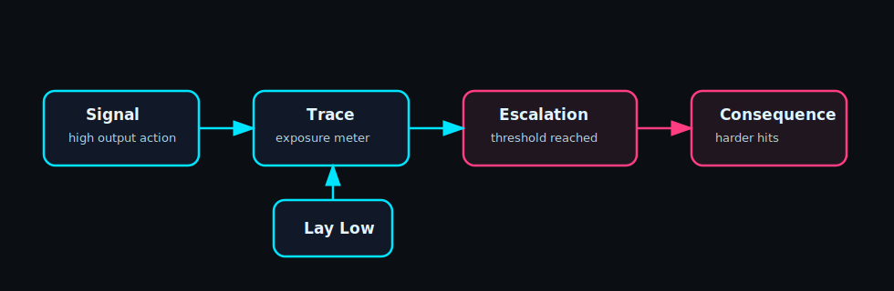
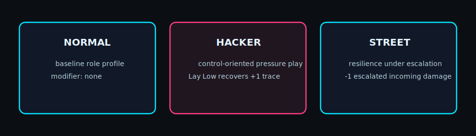
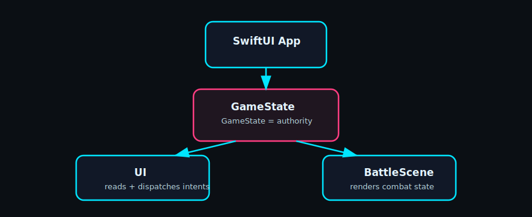

# Shadowrune

> Tactical cyberpunk-fantasy strategy prototype built in SwiftUI + SpriteKit  
> A pressure-driven combat system where every action trades power for exposure.

---

## 🚧 Status

| Category | Value |
|--------|------|
| Platform | iOS |
| Engine | SwiftUI + SpriteKit |
| State | Prototype |
| Build | Xcode required |
| Validation | NOT_COMPUTABLE (no xcodebuild in container) |

---

## 🤝 Collaborator Handoff

If you are picking this repo up from another contributor, start here:

1. Read `plans.md` — the top "Handoff" section is the active status dispatch; it lists what just shipped, what's still broken, and the next suggested moves.
2. Read `AGENTS.md` for workflow conventions, branch/commit expectations, and PR standards.
3. Review `docs/TurnAuthorityReport.md` and `docs/TraceSystem.md` before touching gameplay logic.
4. Keep `GameState` as runtime authority; rendering/UI should remain projection layers.

Handoff updates should always include:
- what changed
- what remains
- what is blocked
- what should be tackled next

---

## 🎮 Core Loop



- Signal → gain power, increase trace  
- Trace → builds toward escalation  
- Escalation → enemies hit harder  
- Lay Low → reduce trace, lose tempo

---

## 🧠 Roles



| Role | Identity | Effect |
|------|--------|--------|
| Normal | baseline | no modifier |
| Hacker | control | +1 trace recovery on Lay Low |
| Street | resistance | -1 escalated damage |

---

## 🗺️ Mission Types

| Type | Objective |
|------|----------|
| Survive | Survive X turns |
| Eliminate | Eliminate all enemies |

---

## 🎚️ Pressure Presets

| Preset | Trace Threshold | Feel |
|--------|----------------|------|
| Low | 5 | Forgiving |
| Standard | 4 | Balanced |
| High | 3 | Stressful |

---

## 🔁 In-Combat Toggles (Dev/Test)

- ROLE → cycle roles
- PRESET → cycle pressure levels
- TYPE → cycle mission type

## ⚙️ Systems

### GameState (Authority)
- single source of truth
- handles turn flow, trace, escalation

### BattleScene (Rendering)
- SpriteKit combat projection
- reflects GameState, does not own logic

### Trace System
- Street / Signal modes
- threshold-based escalation
- deterministic pressure

---

## 📊 Trace Model

| State | Effect |
|------|-------|
| Signal | +trace |
| Warning | threshold - 1 |
| Escalation | +incoming damage |
| Lay Low | -trace (costs turn) |

---

## 🧱 Architecture



---

## 📦 Project Structure

```text
.
├── AGENTS.md
├── plans.md
├── Assets.xcassets/
├── Entities/
├── Game/
├── Missions/
├── Rendering/
├── UI/
├── docs/
│   ├── assets/
│   ├── DuplicateWorkspaceAudit.md
│   ├── README.md
│   ├── SmokeTestPlan.md
│   ├── TraceSystem.md
│   └── TurnAuthorityReport.md
├── Info.plist
├── ShadowrunGameApp.swift
└── ShadowrunGame.xcodeproj/
```

---

## ▶️ Run

### Xcode
1. Open `ShadowrunGame.xcodeproj`
2. Select scheme `ShadowrunGame`
3. Run on an iOS simulator

### CLI
```bash
xcodebuild -project ShadowrunGame.xcodeproj -scheme ShadowrunGame -destination 'platform=iOS Simulator,name=iPhone 16' build
```

Note: iOS builds require macOS + Xcode.

---

## 🧪 Validation

- Container: NOT_COMPUTABLE
- Use local Xcode for real runs

---

## 📜 Patch History

| Patch Drop | Scope | Result |
|-----------|-------|--------|
| 0 | Baseline combat prototype (phase flow + SpriteKit scene) | Playable prototype scaffold |
| 1 | Turn authority mapping and diagnostics reporting | `GameState` documented as runtime authority |
| 2 | Trace loop (`Street/Signal`), Lay Low, role modifiers, escalation hooks | Deterministic pressure loop integrated |
| 3 | Docs + visual cleanup pass | README + SVG visual docs standardized |
| 4 | Collaborator handoff docs (`README`, `AGENTS.md`, `plans.md`) | Team continuity and clearer execution lanes |

---

## 🧭 Roadmap

- role selection UI
- mission presets
- enemy pressure behaviors
- additional roles

---

## 🧠 Design Rules

- GameState is authority
- No system expansion without gameplay pressure
- Roles modify systems, not replace them
- Complexity must reduce ambiguity
