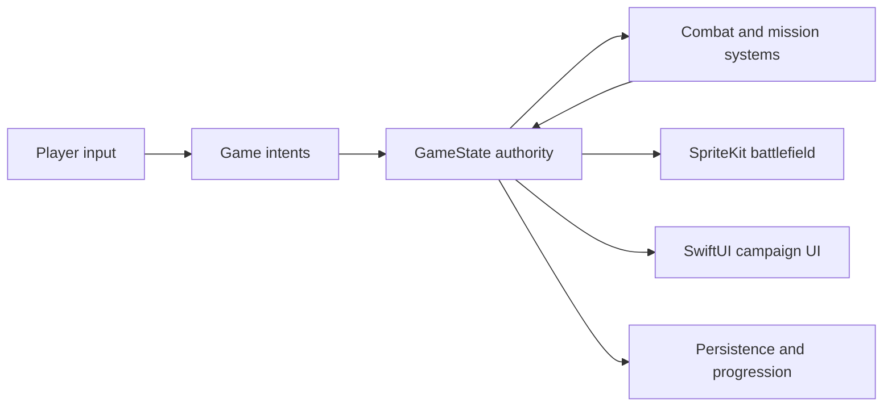

<div align="center">

# HEXWIRE

### Turn-based cyberpunk strategy tactics for iPhone and iPad

**Take the contract. Build the crew. Burn the signal. Get out before the city learns your name.**

[](https://github.com/scrimshawlife-ctrl/Hexwire/actions/workflows/hexwire-ci.yml)
[](project.yml)
[](project.yml)
[](#under-the-neon)
[](#under-the-neon)
[](plans.md)

[The World](#the-city-is-listening) · [The Crew](#four-runners-one-bad-plan) · [Combat](#every-turn-leaves-a-trace) · [Modes](#the-work-never-ends) · [Build](#jack-in) · [Atlas](#repository-atlas)

</div>

---

## The city is listening

The city sold its nervous system to the highest bidder.

Every camera is awake. Every transit gate keeps a memory. Every corporate district is a sealed machine built to recognize the wrong face at the wrong time. Data brokers trade reputations like ammunition. Private security responds before the law knows a crime happened. Somewhere above the rain, an executive dashboard is turning human movement into risk scores.

You are not here to fix that system.

You are here to rob it.

**HexWire** is a turn-based cyberpunk strategy tactics game built around small-team infiltration, authored multi-room operations, persistent consequences, and a combat economy where speed creates exposure. You command a crew of specialists across a hex-grid battlefield, spend scarce actions to break hostile positions, extract before the network closes around you, and carry the consequences into the next job.

The fantasy is not invincibility. It is competence under pressure.

A clean mission pays. A loud mission pays faster. A reckless mission changes what the city sends after you next.

---

## Four runners. One bad plan.

A HexWire crew is built from four complementary archetypes. None of them owns the battlefield alone; the game lives in the space between their abilities.

| Runner | Function | Battlefield identity |
|---|---|---|
| **Street Samurai** | Frontline pressure | Closes distance, absorbs risk, and turns positional advantage into decisive force. |
| **Mage** | Arcane control | Shapes contested space, punishes clustered threats, and bends the encounter outside ordinary rules. |
| **Decker** | Signal warfare | Exploits the network, accelerates tactical plays, and makes the fastest path the most dangerous one. |
| **Face** | Social and support leverage | Keeps the operation coherent, creates openings, and converts preparation into survival. |

The crew moves as a single operational system. Positioning, initiative, room sequencing, damage, extraction, economy, and persistence all feed forward. A mistake in one room becomes the shape of the next.

---

## Every turn leaves a trace

At the center of HexWire is a pressure loop built around two ways of acting:

### STREET

Reliable. Controlled. Slow enough to disappear inside the noise.

Street actions resolve without increasing trace. They preserve operational safety but surrender tempo to the opposition.

### SIGNAL

Fast. Powerful. Visible.

Signal actions create immediate tactical leverage while raising your trace level. Push it too far and the hostile network escalates: enemy awareness hardens, incoming damage increases, and the mission begins charging interest on every shortcut you took.

### LAY LOW

You can reduce trace, but there is no free reset. Laying low consumes a full turn. The crew survives by deciding when tempo matters more than safety—and when one more aggressive action will turn a winning position into a collapse.

> **Signal → Power → Trace → Escalation → Lay Low → Tempo Tradeoff**


Trace is not a cosmetic alert meter. It is the combat clock the player chooses to wind.

---

## The shape of a run

Every operation follows a tactical rhythm:

1. **Take the contract** — enter an authored story mission, side contract, arena, or gauntlet run.
2. **Read the room** — study walls, lanes, enemy positions, initiative, objectives, and extraction conditions.
3. **Commit the crew** — move across the hex grid, attack, cast, hack, support, or sacrifice tempo to reduce exposure.
4. **Clear forward** — move through connected rooms while carrying damage, pressure, and mission state with you.
5. **Hit the objective** — acquire data, eliminate resistance, survive the encounter logic, or satisfy the mission gate.
6. **Reach extraction** — physically move a runner onto the armed extraction tile and resolve the operation.
7. **Live with it** — collect nuyen, preserve progression, alter faction attention, upgrade the crew, and decide what risk comes next.

Victory is not simply killing the final enemy. The job ends when the crew gets out.

---

## Authored campaigns, unstable replays

HexWire currently contains **six machine-certified multi-room story missions**, supported by scene-driven interstitial operations and repeatable combat modes.

### Story operations

Each mission is built as a connected room graph with authored enemies, boss or unique slots, objective logic, extraction conditions, payout, defeat handling, replay behavior, and save/resume persistence.

The story campaign is designed to feel deliberate rather than procedurally anonymous: rooms have authored tactical intent, while seeded replay rerolls vary ordinary opposition without replacing bosses, unique encounters, or mission structure.

### Interstitial operations

Between major missions, the campaign shifts format through scene-driven encounters including:

- **Mirrorline**
- **The Drop**
- **Basement Brawl**
- **Cold Trace**

These sequences widen the fiction beyond the standard combat board while still routing rewards and objectives through the same authoritative progression system.

---

## The work never ends

The campaign is only one layer of the city.

| Mode | What it does |
|---|---|
| **Side Contracts** | Tiered operations generated from the contract board, built for repeatable risk and progression. |
| **Arenas** | Twenty validated combat spaces selected through seeded contract generation. |
| **Endless Gauntlet** | Escalating floors, shifting enemy composition, persistent best-floor tracking, and failure that sends the crew back to floor one. |
| **Seeded Replay** | Rerolls standard opposition while preserving authored structure, boss identity, positions, and mission logic. |
| **New Game+** | Carries the campaign forward into a higher-pressure progression cycle. |

The persistent layer includes **nuyen, black-market access, cyberware, faction heat, mission completion, replay state, and campaign scaling**. The city remembers both success and attention.

---

## Tactical identity

HexWire is built around a specific kind of strategy:

- **Turn-based, not twitch-based** — the player has time to read the board, but every action changes the pressure state.
- **Position-first combat** — walls, lanes, movement budgets, room topology, and extraction placement determine what is possible.
- **Small-team synergy** — runners are designed as interlocking roles rather than isolated damage engines.
- **Objective-driven missions** — combat is part of the operation, not always the complete operation.
- **Persistent consequence** — rewards, faction attention, upgrades, campaign progress, and replay state survive beyond the room.
- **Deterministic authority** — identical inputs and seeded conditions resolve consistently, making tactics testable rather than theatrical.

The intended feeling is a cyberpunk heist collapsing one measured decision at a time.

---

## Under the neon

HexWire is an iOS-native game built with:

| Layer | Technology |
|---|---|
| Application and campaign UI | **SwiftUI** |
| Tactical battlefield | **SpriteKit** |
| Core language | **Swift 5.9** |
| Project generation | **XcodeGen 2.46.0** |
| Minimum deployment target | **iOS 17.0** |
| Supported devices | **iPhone and iPad** |
| Build validation | **GitHub Actions on macOS** |

The gameplay architecture follows one hard rule:

> **`GameState` is the single gameplay authority.**

SwiftUI and SpriteKit do not independently decide outcomes. Presentation surfaces emit intents through the game-intent and combat-flow seams, then render the authoritative result. This prevents animation, touch handling, or scene timing from silently becoming a second rules engine.


```mermaid
flowchart LR
    P[Player input] --> I[Game intents]
    I --> G[GameState authority]
    G --> C[Combat and mission systems]
    C --> G
    G --> S[SpriteKit battlefield]
    G --> U[SwiftUI campaign UI]
    G --> V[Persistence and progression]
```

---

## Current state

HexWire is a **stabilized vertical slice**, not yet a finished App Store release.

The current repository includes:

- Six certified multi-room story missions
- Scene-driven interstitial missions
- Deterministic combat and seeded replay behavior
- Twenty validated arenas
- Side-contract tiers 1–3
- Gauntlet progression across the tested scaling band
- Persistent economy, campaign, and upgrade state
- iPhone and iPad layouts
- Debug and Release simulator builds
- Unsigned release archive generation
- Hosted CI on every pull request and push to `main`

Remaining release work is concentrated around the owner’s real-device pass, ship configuration, signing, and App Store metadata. See [`plans.md`](plans.md) for the active release frontier.

---

## Jack in

### Requirements

- macOS
- Xcode with an iOS 17+ SDK
- XcodeGen **2.46.0**

### Generate the project

```bash
xcodegen generate
```

`HexWire.xcodeproj` is generated from [`project.yml`](project.yml). After adding or removing files, regenerate and commit the project. CI rejects project drift.

### Build

```bash
xcodebuild \
  -project HexWire.xcodeproj \
  -scheme HexWire \
  -destination 'platform=iOS Simulator,name=iPhone 17' \
  build
```

### Test

```bash
xcodebuild \
  -project HexWire.xcodeproj \
  -scheme HexWire \
  -destination 'platform=iOS Simulator,name=iPhone 17' \
  test
```

For repeated test runs, pre-boot the simulator to avoid cold-launch instability:

```bash
xcrun simctl boot <udid> || true
xcrun simctl bootstatus <udid> -b
```

### Launch directly into a mission

Debug builds honor `SR_AUTOSTART_MISSION_ID`:

```bash
SR_AUTOSTART_MISSION_ID=Mission003
```

Use `Mission001` through `Mission006` to bypass campaign navigation and enter a mission directly.

---

## Validation is part of the design

HexWire treats gameplay claims as executable obligations.

The hosted `hexwire-ci` workflow checks:

| Gate | Coverage |
|---|---|
| Repository hygiene | Nested repositories, tracked build output, user state, backup projects, and stray workspaces |
| Mission data | JSON validity and unique mission identifiers |
| Asset safety | Duplicate runtime asset-name detection |
| Project reproducibility | XcodeGen regeneration and drift rejection |
| Deterministic tests | Combat, authority, economy, persistence, missions, replay modes, and player movement semantics |
| Device matrix | Debug and Release builds for iPhone and iPad simulators |
| Archive path | Unsigned generic-iOS Release archive |
| Resource integrity | Missing-resource warning gate |

The authoritative status signal is the live CI badge at the top of this README. Historical documents may contain older test-count snapshots; green CI on `main` is the current truth surface.

---

## Repository atlas

```text
Hexwire/
├── Game/                         # Intents, combat flow, authority-facing systems
├── Missions/                     # Authored mission JSON
├── Sprites/                      # SpriteKit runtime art
├── Assets.xcassets/              # Asset catalog
├── tests/                        # Deterministic and certification suites
├── docs/
│   ├── TraceSystem.md            # Signal, trace, escalation, and Lay Low loop
│   ├── architecture/             # Extraction and authority architecture
│   ├── audit/                    # Build, test, mission, persistence, and repo evidence
│   └── archive/                  # Superseded historical material
├── .github/workflows/            # Hosted CI
├── project.yml                   # Canonical XcodeGen specification
├── AGENTS.md                     # Contributor and coding-agent rules
└── plans.md                      # Current verified baseline and next actions
```

### Start here

| Document | Purpose |
|---|---|
| [`plans.md`](plans.md) | Current mission, verified baseline, blockers, and next actions |
| [`AGENTS.md`](AGENTS.md) | Repository workflow and authority invariants |
| [`docs/TraceSystem.md`](docs/TraceSystem.md) | The Street / Signal / Trace pressure system |
| [`docs/audit/MissionCertificationMatrix.md`](docs/audit/MissionCertificationMatrix.md) | Evidence for missions, arenas, contracts, gauntlet, and extraction semantics |
| [`docs/audit/GameStateAuthorityMutationLedger.md`](docs/audit/GameStateAuthorityMutationLedger.md) | Gameplay authority and mutation boundaries |
| [`docs/audit/PersistenceCertificationReport.md`](docs/audit/PersistenceCertificationReport.md) | Save, migration, corruption, and resume evidence |
| [`docs/architecture/StabilizationExtractionMap.md`](docs/architecture/StabilizationExtractionMap.md) | Current system decomposition and deferred extraction candidates |

---

## Operating rules

Contributions should preserve four invariants:

1. `GameState` remains the gameplay authority.
2. Presentation layers emit intents and render results; they do not invent outcomes.
3. Mission, replay, progression, and persistence behavior must remain deterministic under controlled seeds.
4. No completed claim is accepted without a test, build receipt, runtime evidence, or an explicit `NOT_COMPUTABLE` boundary.

Read [`AGENTS.md`](AGENTS.md) before changing combat flow, mission state, persistence, project structure, or generated Xcode files.

---

<div align="center">

### The signal makes you powerful. The trace makes you mortal.

**HexWire** — turn-based cyberpunk strategy tactics for iOS.

</div>
